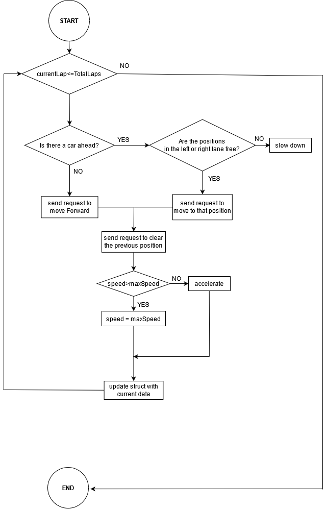

Multithreaded Grand Prix Simulator
==================================

Architecture
----------------------
The behaviour of each racer is managed on separate threads, this threads will simulate the movements of the car and then send a request to the main function through a channel,thanks to these requests the main function will manage the positions of all racers.

All the racers count with a struct that contains their data:
- name: Name of the racer      
- lane: Current lane     
- position: Where are they located on the track
- lap : Current lap       
- speed: Curren speed     
- lapTime: Time elapsed since the start of one lap until the end of it

Some of this data will change along the race, the values changes are managed by the threads and then communicated through a channel.

Diagrams
----------------------
- Main

- Thread

